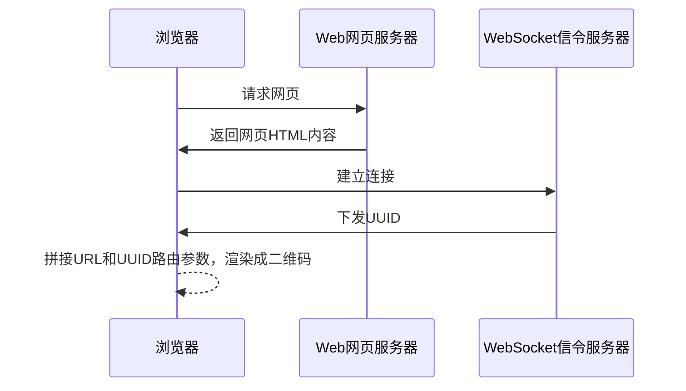
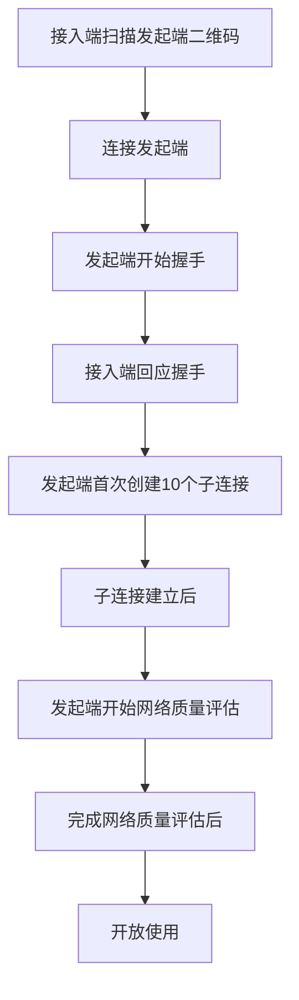
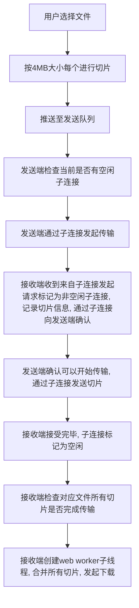

项目地址：[Github](https://github.com/Binarization/filetransfer)

在线预览：[Direct Transfer](https://transfer.binrz.com/)

## 1. 前言

人们习惯使用即时聊天工具自带的文件传输功能（如QQ、微信）、网络云盘（百度网盘、蓝奏云、WeTransfer）。但这些应用服务没用点对点的文件传输机制，只支持单线程传输、需要中转服务器、步骤繁杂等流程。也需要下载客户端安装、注册、登录等步骤；传送的文件经过了应用服务器中转存在信息隐私风险等问题。

为了解决以上难点，本项目提出Direct Transfer直传的方案：基于WebRTC的Peer.js P2P通讯库，实现点对点网页的大文件多线程传输应用。同时，为了方便用户连接的体验操作，采用vue-qrcode-reader实现了网页端的二维码扫描功能，用户通过手机进行二维码扫描就与网页发起端建立连接。通过本网页应用，您能和朋友分享手机上的音乐，视频，文件资料，图片滑动，以及其他任何格式的文件到指定的智能终端。

## 2. Direct Transfer概述

通常，人们习惯使用即时聊天工具自带的文件传输功能（如QQ、微信）、网络云盘（百度网盘、蓝奏云、WeTransfer）。但这些网站并不专注于点对点的文件传输，并未对此做出优化，如：只支持单线程传输、需要中转服务器、步骤繁杂等等。为了解决以上难点，本项目决定使用基于WebRTC的Peer.js P2P通讯库实现点对点网页大文件多线程传输应用。

为了优化用户连接体验，本项目使用了vue-qrcode-reader实现了网页端的二维码扫描功能。用户可以通过使用手机自带或网页上的二维码功能与发起端建立连接。

## 3. Direct Transfer设计方案

Direct Transfer一共由四大部分组成：Web网页服务器、Web Socket信令服务器、ICE服务器、浏览器。

Web服务器采用了Cloudflare提供的Cloudflare Pages，在上面部署了本项目的前端代码。

Web Socket信令服务器采用了Peer.JS开源社区所维护的公共服务器，负责Peer ID的发布和建立点对点连接所需要信息的中转功能。

ICE服务器使用浏览器默认配置，如Chrome浏览器会使用Google维护的STUN服务器（stun.l.google.com ），负责帮助浏览器收集当前设备所有可用连接IP。

## 4. 业务实现方案

### 4.1 创建Peer实例

每当有客户端要创建或加入一个点对点会话时，都需要先创建一个Peer实例。首先，浏览器先通过URL，访问WEB服务器获取传输页面的代码，加载页面。网页加载完毕后，会调用Peer.js创建Peer实例，获取Peer ID并通过Web Scoket协议连接至Peer.js的公共信令服务器。

### 4.2 发起邀请

发起端在完成Peer实例的创建后，会通过拼接URL和Peer ID生成会话邀请链接，依赖ant-design-vue的二维码组件，向用户呈现邀请二维码和链接。

### 4.3 加入会话

接入端在通过输入会话邀请链接或扫描邀请二维码后，将跳转至WEB服务器的传输页面。待完成Peer实例创建流程之后，将会根据邀请链接中传入的发起端Peer ID，向信令服务器发送带本机SDP信息的OFFER包。与此同时，也会通过本机和STUN服务器收集当前本机所有可用网络连接IP，依次将带着发起端的Peer ID的CANDIDATE包发送至信令服务器。

信令服务器在收到接入端OFFER包和CANDIDATE包后，将会依据发送来源，添加记录接入端Peer ID的`dst`字段，并转发给`src`字段中记录的Peer ID所对应的发起端Peer实例。

发起端在收到来自接入端的OFFER包和CANDIDATE包后，会根据OFFER包记录的协议、加密等参数，和CANDIDATE包记录的IP和端口号，尝试与接入端进行连接。同时为了最大化提高在NAT网络环境下的网络穿透成功率，将会重复接入端的上述操作，通过信令服务器发送带本机SDP信息的OFFER包和记录本机可用网络连接IP和端口的CANDIDATE包至接入端的Peer实例。

在发起端和接入端双端之间，有一端成功连接至对端后，则负责主连接的RTCDataChannel完成创建。

### 4.4 文件传输连接建立

为了保证双方连接到的对端都是Direct Transfer应用，而不是其他基于WebRTC开发的应用。在主连接建立完成后，将会由发起端发起handshake握手包，内容包括通过解析浏览器User-Agent获取到的设备类型及浏览器类型，以及文件传输时需要建立的子连接数。接入端从与发起端的主连接接收到的握手包后，也会发送带有本机设备和浏览器类型和文件传输时需要建立的子连接数的handshake握手包给发起端。

发起端收到接入端的握手包后即代表握手阶段结束，双端都会将对端的设备和浏览器信息呈现给用户，以便用户识别对端身份。

### 4.5 网络质量评估

双端握手阶段结束后，双方都会创建负责维护子线程连接和文件分片传输的FileTransfer模块实例。在发起端创建FileTransfer实例后，将会首先创建10个子连接用于双端之间的网络测速。等待10个子连接都创建完成，发起端便会开始在每一个子连接发送一个大小为2MB大小的`benchmark`测速包，并在每次发送之间添加50~100ms的随机延时以避免并发阻塞。接入端会在测速包传输完成后再向发起端回传一个`benchmarkDone`测速完成包。发起端收到测速完成包后则会将当前时间减去发送时间获取传输所花费的时间。测速阶段设有超时机制，如果发起端在10秒后仍未收到所有测速包结果，则会中断仍在发送测速包的所有子连接，并向用户提示“当前网络环境较差，建议将两端设备连接至同一网络下”的提示文案，如用户仍坚持使用，则在之后的文件传输将忽略传输超时机制。如果发起端在10秒内收到所有测速包结果，将计算平均传输速度，以便为之后的文件传输提供超时参数。

测速完成后，将按之前握手阶段双端协商好的子连接数完成后续连接，同时向用户开放文件传输功能。

- 接入端扫描发起端二维码，连接发起端
- 发起端连接成功后，发起端开始握手
- 接入端回应握手
- 发起端首次创建10个子连接
- 子连接建立后，发起端开始网络质量评估
- 完成网络质量评估后，开放使用

### 4.3 文件发送

- 用户选择文件
- 按4MB大小每个进行切片
- 推送至发送队列回车
- 发送端检查当前是否有空闲子连接
- 发送端通过子连接发起传输
- 接收端收到来自子连接发起请求，标记为非空闲子连接，记录切片信息，通过子连接向发送端确认
- 发送端确认可以开始传输，通过子连接发送切片
- 接收端接受完毕，子连接标记为空闲
- 接收端检查对应文件所有切片是否完成传输
- 接收端创建web worker括号子线程，合并所有切片，发起下载

