参考视频：

[0基础让你快速学会Blender渲染MMD 全过程保姆级](https://www.bilibili.com/video/BV1na4y157fs/)

[最简单基础的blender三渲二mmd方法](https://www.bilibili.com/video/BV1m5411y7qf/)

## 软件安装

### Blender 本体

下载并安装[Blender 3.6 LTS版本](https://www.blender.org/download/lts/3-6/)（mmd_tools插件目前还不完全支持最新4.0版本）

### mmd_tools插件

前往`blender_mmd_tools`Github代码仓库[Releases](https://github.com/UuuNyaa/blender_mmd_tools/releases)页面下载最新版本zip压缩包；

下载完成后，打开Blender，依次点击“编辑”-“偏好设置...”-“插件”-“安装...”，在弹出的文件选择窗口中选中下载的zip压缩包安装插件；

安装完成后在插件列表找到mmd_tools插件，选中左侧选中框启用插件，然后重启Blender；

在预览页面按键盘“N”切换Tab页，可以看到`mmd_tools`标签页，即为安装成功。

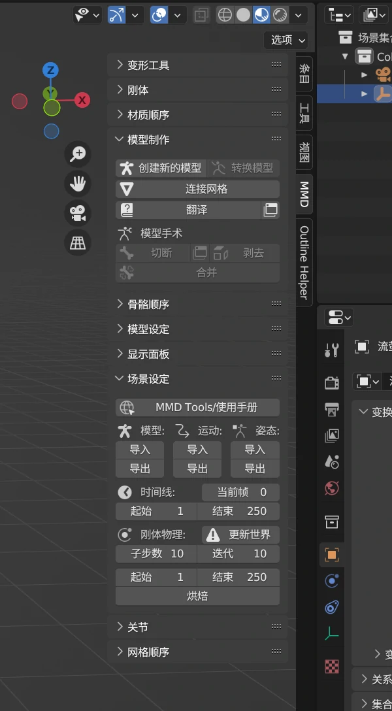

### MikuMikuMoving（可以不用）

[官网原版下载](https://sites.google.com/site/mikumikumoving/mikumikumoving)

[汉化版下载](https://ifwz.lanzouw.com/iwDEZ0awbr8j)

*注：运行主程序可能需要管理员权限，否则无法正常运行*

## MMD入门制作流程

### 预烘焙动作（可以不用）

1. 打开MikuMikuMoving，先点击“加载模型”，然后再“导入动作”；
2. 切换到“物理”选项卡，点击“记录”，等待物理结算完成；
3. 回到“文件”选项卡，点击“导出动作”。

### 导入人物模型

1. 打开Blender后，点击弹出窗口以外的区域，进入默认空白项目；

2. 删除默认的立方体Cube对象和灯光Light对象；

3. 打开`mmd_tools`选项卡，在“场景设定”-“模型”下点击“导入”按钮，从弹出的文件选择框内找到要导入的人物`.pmx`模型并导入，注意调整右侧参数框的“缩放”参数；

4. 在略微卡顿后，人物模型便导入成功并出现在预览框内了；

5. 在预览框右上角，切换“视图着色方式”为“材质预览”（从右往左数第二个），等待着色器编译完成后，检查贴图是否显示正常；

   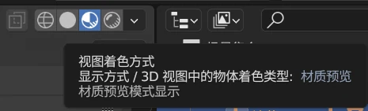

6. 在右下角“属性”窗口中，进入“输出”参数设置标签页，更改帧率参数为需要的数值（**务必在导入任何关键帧，如人物动作、相机动作等前完成，否则后期修改可能导致动画速率异常**）

   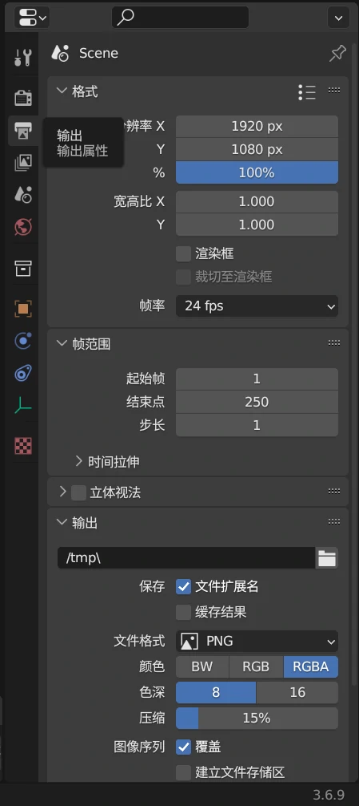

### 导入人物动作

1. 在预览窗口中选中人物骨骼

   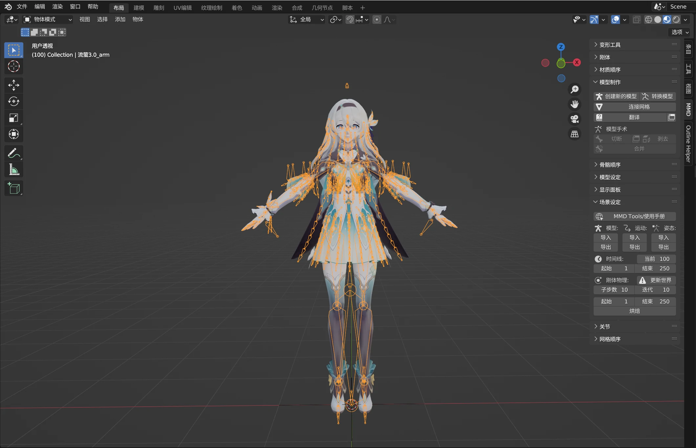

2. 回到`mmd_tools`选项卡，在“场景设定”-“动作”下点击“导入”按钮，从弹出的文件选择框内找到要导入的人物`.pmx`模型并导入，注意调整右侧参数框的“缩放”和“边距”参数；
   *边距*：导入的关键帧从多少帧开始插入，一般设为0

3. 动作导入过程中，窗口可能会进入假死状态，等待其导入完毕即可；
   *若导入后的动作出现脚始终固定在原点的情况，`Ctrl+Z`撤销动作导入，在`mmd_tools`标签页中找到“模型设置”-“IK切换”并取消下面四个选项，然后重复上述导入操作*

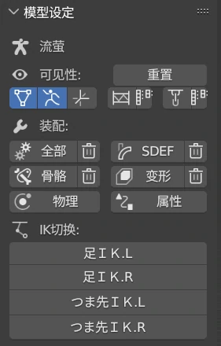

4. 若模型部分组件未自带物理结算，可选中骨骼，点击“模型设置”-“装配”-“全部”，使用Blender自带物理结算；

5. 在右下角“属性”窗口，进入“场景”参数设置标签页，修改重力参数，避免模型在大幅度运动时走光（推荐-12~-20 $m/s^2$）；

    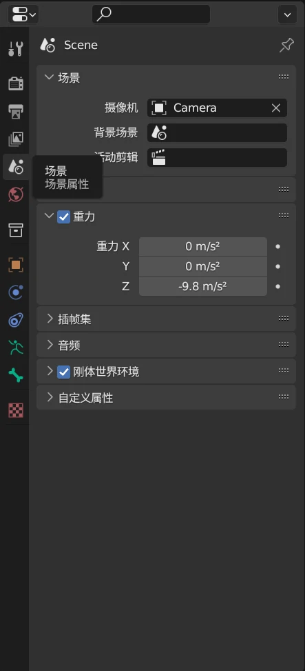

6. 回到`mmd_tools`标签页，进入“场景设定”-“刚体物理”，点击“更新世界”预览重力效果，确认无误后，点击下方“烘焙”开始烘焙动作物理效果；

7. 待底部进度条走完，烘焙完成。

### 着色器设置

1. 在右下角“属性”窗口中，进入“渲染”参数设置标签页，更改“采样”-“渲染”为`256`，启用“辉光”效果；

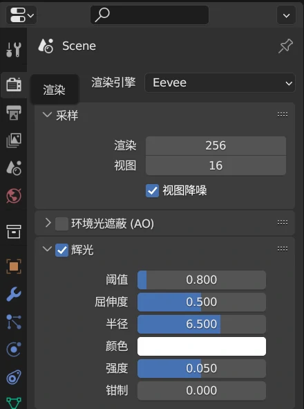

2. 选中模型；

   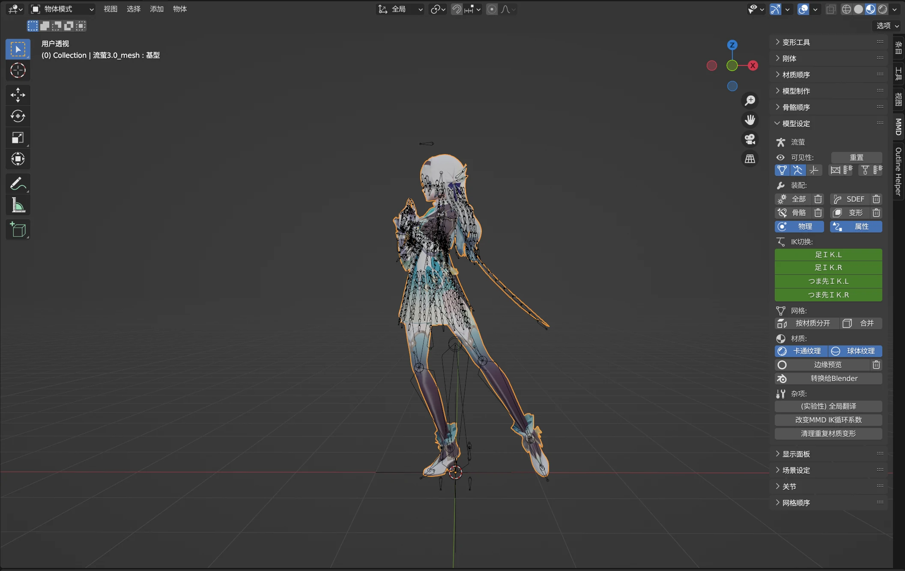

3. 在`mmd_tools`标签页，进入“模型设定”-“材质”，点击“转换给Blender”，然后在上面的“网格”中点击“按材质分开”;

4. 进入“着色”流程页；

5. 预览窗口右上角切换“视图着色方式”为“渲染”（从右往左数第一个），点击旁边箭头打开下拉框，修改“渲染通道”为“漫射颜色”

![](../img/post_assets/2024-03-04-Blender-xue-xi-bi-ji-Day-1/image-20240304175704735.webp

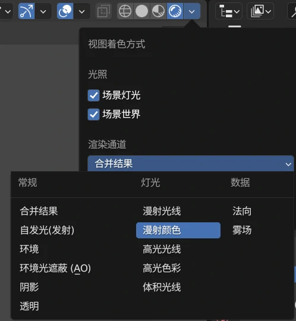

6. “视图叠加层”中选择隐藏“骨骼”

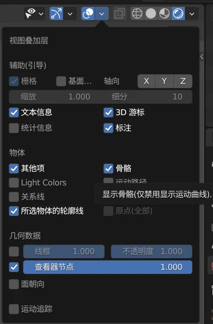

7. 依次给所有部件都设置好节点

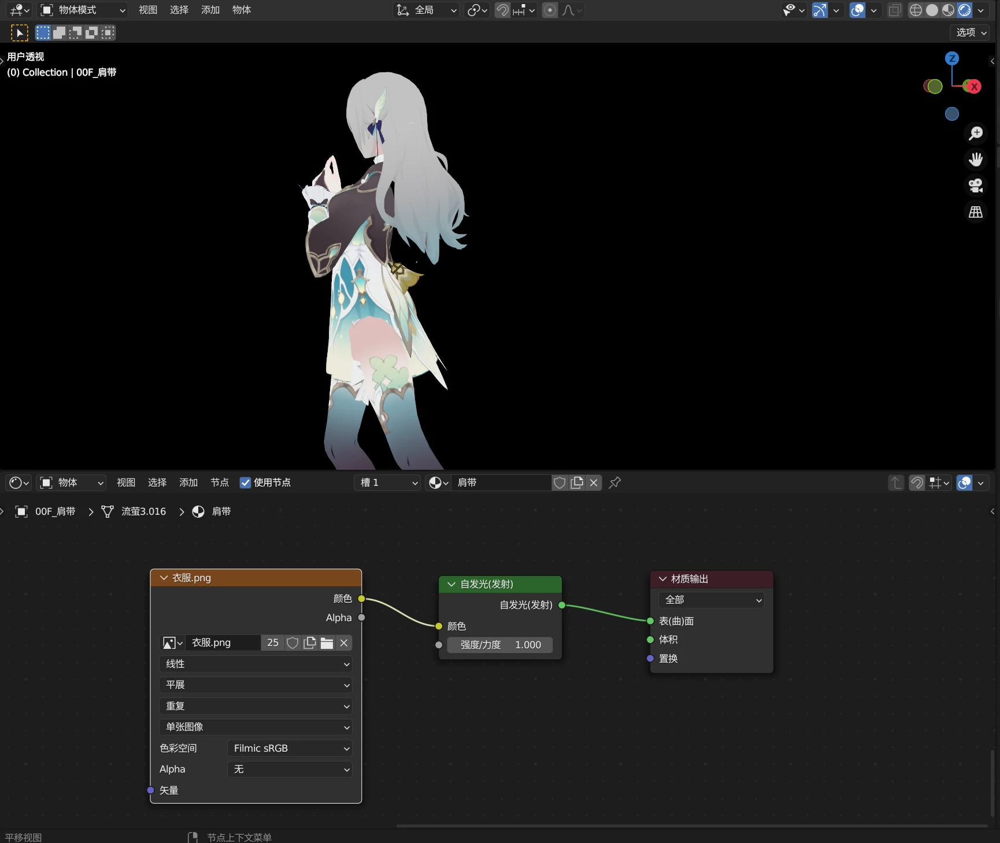
